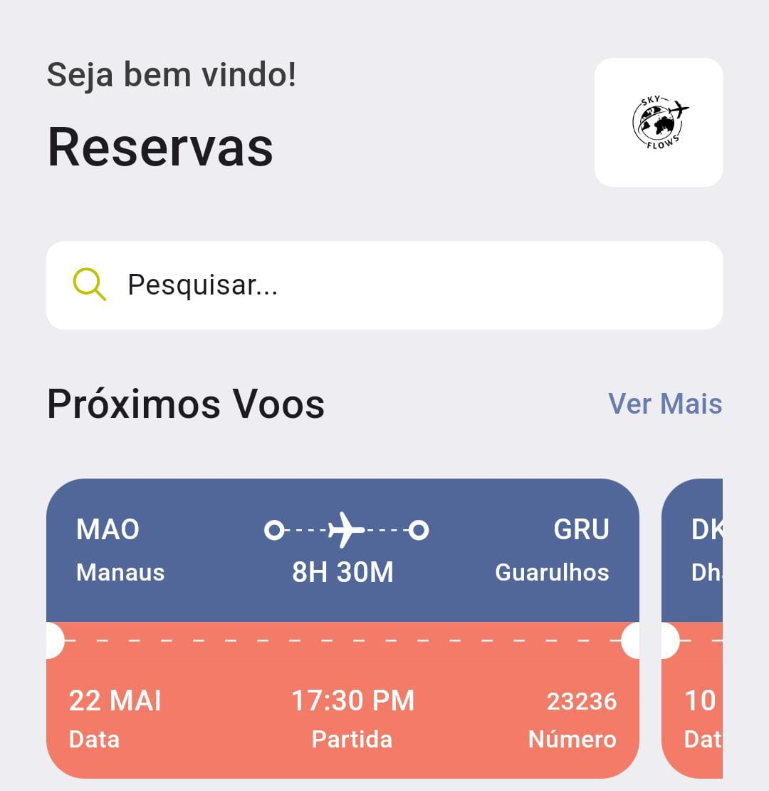
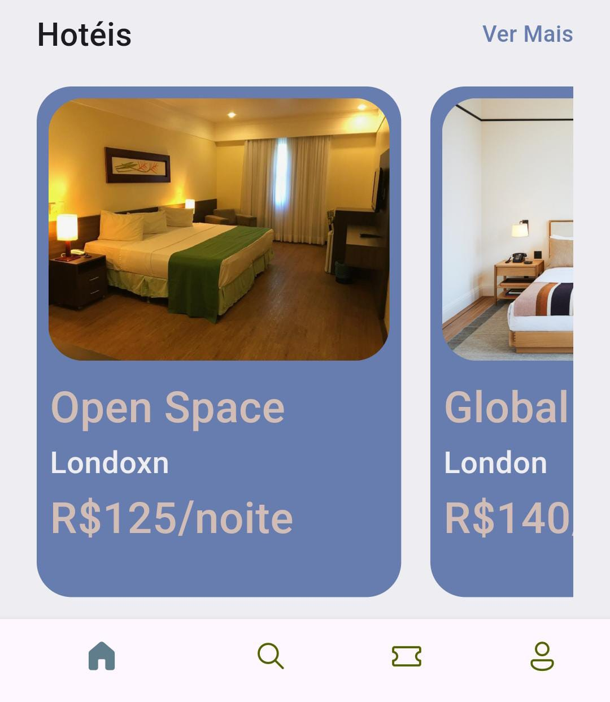
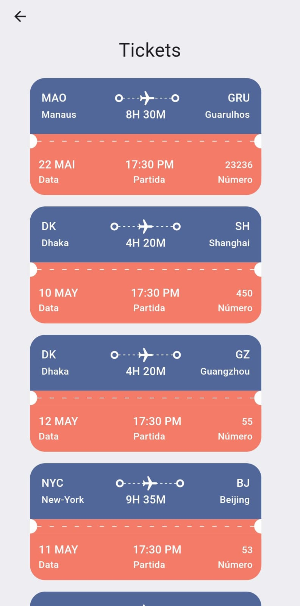
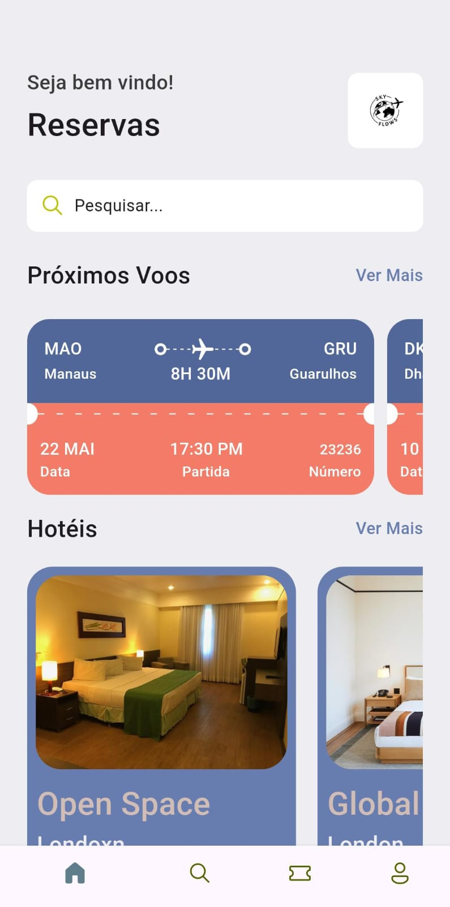

# SkyFlows

Projeto Flutter, Primeiro contato

## Resumo:

Basicamente, explorando as propriedades do Flutter foi possível desenvolver uma aplicação que coleta informações de um arquivo .json e aplica a um layout pré-definido.

O layout inclui:
- Carrosséis
- Ícones (Cupertino)
- Redirecionamentos (Push)
- Paleta de cores
- Widgets Reaproveitáveis (Don't Repeat Yourself)

## Screenshots

### Carrossel (Voos)

### Carrossel (Hotéis)

### Lista de Tickets

### Screenshot Completa

